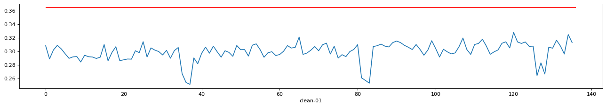

# Anomaly Detection Neural Network with Attention

This readme consists of four main parts to briefly describe the workflow of training a Recurrent Neural Network with attention layer model to classify anomaly events in a sequence based embeded software log. These four parts are Data Loading and Preprocessing, Model building, Model training, Results Analysis and Visualization. Check the python notebook for details.

#### Data loading and preprocessing

* Load in all 15 .csv data files, and save as pandas dataframes.

#### Overview of the data

* Groupby `class` and `event` column in the dataframe to get the occurrence count of different events under different class.

<table border="1" class="dataframe">
  <thead>
    <tr style="text-align: right;">
      <th></th>
      <th></th>
      <th>clean-01</th>
      <th>clean-02</th>
      <th>clean-03</th>
      <th>clean-04</th>
      <th>clean-05</th>
      <th>clean-06</th>
      <th>clean-07</th>
      <th>clean-08</th>
      <th>clean-09</th>
      <th>clean-10</th>
      <th>fifo-ls-01</th>
      <th>fifo-ls-02</th>
      <th>fifo-ls-sporadic</th>
      <th>full-while</th>
      <th>half-while</th>
    </tr>
    <tr>
      <th>class</th>
      <th>event</th>
      <th></th>
      <th></th>
      <th></th>
      <th></th>
      <th></th>
      <th></th>
      <th></th>
      <th></th>
      <th></th>
      <th></th>
      <th></th>
      <th></th>
      <th></th>
      <th></th>
      <th></th>
    </tr>
  </thead>
  <tbody>
    <tr>
      <th rowspan="9" valign="top">COMM</th>
      <th>MSG_ERROR</th>
      <td>6.0</td>
      <td>6.0</td>
      <td>8.0</td>
      <td>6.0</td>
      <td>6.0</td>
      <td>6.0</td>
      <td>6.0</td>
      <td>6.0</td>
      <td>6.0</td>
      <td>6.0</td>
      <td>5715</td>
      <td>5589.0</td>
      <td>6006.0</td>
      <td>509.0</td>
      <td>422.0</td>
    </tr>
    <tr>
      <th>REC_MESSAGE</th>
      <td>17968.0</td>
      <td>17969.0</td>
      <td>17963.0</td>
      <td>18135.0</td>
      <td>18134.0</td>
      <td>18147.0</td>
      <td>18216.0</td>
      <td>18213.0</td>
      <td>18260.0</td>
      <td>18347.0</td>
      <td>65232</td>
      <td>66973.0</td>
      <td>65666.0</td>
      <td>44802.0</td>
      <td>45072.0</td>
    </tr>
    <tr>
      <th>REC_PULSE</th>
      <td>24710.0</td>
      <td>24226.0</td>
      <td>24173.0</td>
      <td>24871.0</td>
      <td>24849.0</td>
      <td>24358.0</td>
      <td>24390.0</td>
      <td>24397.0</td>
      <td>24442.0</td>
      <td>24644.0</td>
      <td>28312</td>
      <td>28349.0</td>
      <td>25631.0</td>
      <td>39342.0</td>
      <td>39529.0</td>
    </tr>
    <tr>
      <th>REPLY_MESSAGE</th>
      <td>17947.0</td>
      <td>17950.0</td>
      <td>17938.0</td>
      <td>18098.0</td>
      <td>18103.0</td>
      <td>18131.0</td>
      <td>18190.0</td>
      <td>18180.0</td>
      <td>18248.0</td>
      <td>18329.0</td>
      <td>59477</td>
      <td>61336.0</td>
      <td>59627.0</td>
      <td>44202.0</td>
      <td>44565.0</td>
    </tr>
    <tr>
      <th>SIGNAL</th>
      <td>NaN</td>
      <td>1.0</td>
      <td>2.0</td>
      <td>NaN</td>
      <td>NaN</td>
      <td>1.0</td>
      <td>NaN</td>
      <td>1.0</td>
      <td>1.0</td>
      <td>2.0</td>
      <td>37</td>
      <td>36.0</td>
      <td>39.0</td>
      <td>NaN</td>
      <td>1.0</td>
    </tr>
    <tr>
      <th>SND_MESSAGE</th>
      <td>18089.0</td>
      <td>18077.0</td>
      <td>18073.0</td>
      <td>18234.0</td>
      <td>18235.0</td>
      <td>18247.0</td>
      <td>18300.0</td>
      <td>18286.0</td>
      <td>18373.0</td>
      <td>18447.0</td>
      <td>65378</td>
      <td>67122.0</td>
      <td>65808.0</td>
      <td>45149.0</td>
      <td>45426.0</td>
    </tr>
    <tr>
      <th>SND_PULSE</th>
      <td>NaN</td>
      <td>NaN</td>
      <td>NaN</td>
      <td>NaN</td>
      <td>NaN</td>
      <td>NaN</td>
      <td>NaN</td>
      <td>NaN</td>
      <td>NaN</td>
      <td>NaN</td>
      <td>882</td>
      <td>884.0</td>
      <td>943.0</td>
      <td>11226.0</td>
      <td>11289.0</td>
    </tr>
    <tr>
      <th>SND_PULSE_DIS</th>
      <td>NaN</td>
      <td>NaN</td>
      <td>NaN</td>
      <td>NaN</td>
      <td>NaN</td>
      <td>NaN</td>
      <td>NaN</td>
      <td>NaN</td>
      <td>NaN</td>
      <td>NaN</td>
      <td>877</td>
      <td>880.0</td>
      <td>958.0</td>
      <td>NaN</td>
      <td>NaN</td>
    </tr>
    <tr>
      <th>SND_PULSE_EXE</th>
      <td>36701.0</td>
      <td>48219.0</td>
      <td>60157.0</td>
      <td>72854.0</td>
      <td>84809.0</td>
      <td>96321.0</td>
      <td>108339.0</td>
      <td>120360.0</td>
      <td>132390.0</td>
      <td>144575.0</td>
      <td>181312</td>
      <td>193406.0</td>
      <td>202078.0</td>
      <td>172297.0</td>
      <td>160365.0</td>
    </tr>
    <tr>
      <th>CONTROL</th>
      <th>BUFFER</th>
      <td>2161.0</td>
      <td>2158.0</td>
      <td>2170.0</td>
      <td>2224.0</td>
      <td>2242.0</td>
      <td>2243.0</td>
      <td>2264.0</td>
      <td>2278.0</td>
      <td>2298.0</td>
      <td>2329.0</td>
      <td>4845</td>
      <td>4938.0</td>
      <td>4751.0</td>
      <td>4326.0</td>
      <td>4334.0</td>
    </tr>
  </tbody>
</table>

From above table, it could be seen that the clean and anomalous files are quite different based on the occurrence counts of different events. For example, normally event `COMM-SND_MESSAGE` occurced around 18000 times, while in the anomalous files it occured around 45000~67000 times. This may not be seen as an effective way to detect anomalous activity, however, it can show a general picture of the data where the anomaly could be residing.

#### Model Building

* Load the encoder and decoder model

The architecture of this model is:

`input of events sequence` ------>>
`encoder(GRU unit)` ------>>
`attention layer` ----->>
`decoder (GRU unit)` ------->>
`output layer`

The input is a small segment of the log file, in this case, 5 continuous events, and the target output is the next 5 continuous events following the input one. The general idea is that using this proposed NN model to train inputs and predicting the following outputs. Assuming the event sequences patterns between the clean and anomalous ones are different, then the preciting/test accuracy should be different using the same model and trained weights.

Check `model.py` file for the details of encoder, attention, and decoder models.

#### Model Training

Check `anomaly_detection_NN_train.ipynb` for details.

#### Results

The next step is to predict results using the above model and trained weights of each layer (saved in `sumitmodel_checkpoint` folder).

The test inputs are processed using event sequence length `Tx = 5`, same as the trained data, while using stride `stride = 5` instead of 2.

Save all the predicted result into .npy files for further analysis use.

* Set anomaly creteria

As mentioned above, Assuming the event sequences patterns between the clean and anomalous ones are different, then the preciting/test accuracy should be different using the same model and trained weights.

In the following code, I use squence length of 1000 as one input sample, and use the above trained model to precited output, and then compare the precited output with target values to get the misclassification accuracy.

After predict outputs on all the 10 clean files, calculate the mean and variance of the misclassification accuracy. Finally, I set the criteria to be (mean + 3* standard_deviation).

Any 1000 events long sequence with  misclassification rate higher than the criteria will be deemed as anomaly segment.

**In this case, any misclaasification rate higher than 0.365 will be classified as anomaly event.**

* Visualize anomalous events

**Normal sequences**

**Abnormal sequences A**

**Abnormal sequences B**

#### Reference

* O. M. Ezeme, Q. H. Mahmoud and A. Azim, "DReAM: Deep Recursive Attentive Model for Anomaly Detection in Kernel Events," in IEEE Access, vol. 7, pp. 18860-18870, 2019.

* https://www.tensorflow.org/tutorials/text/nmt_with_attention
